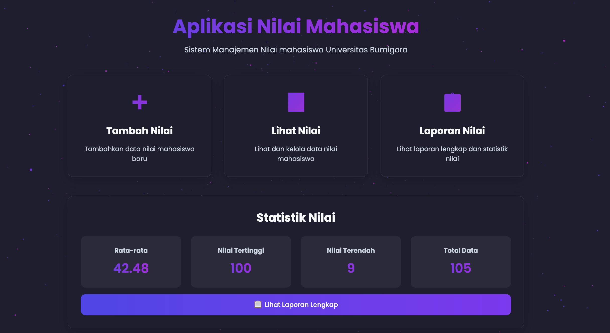
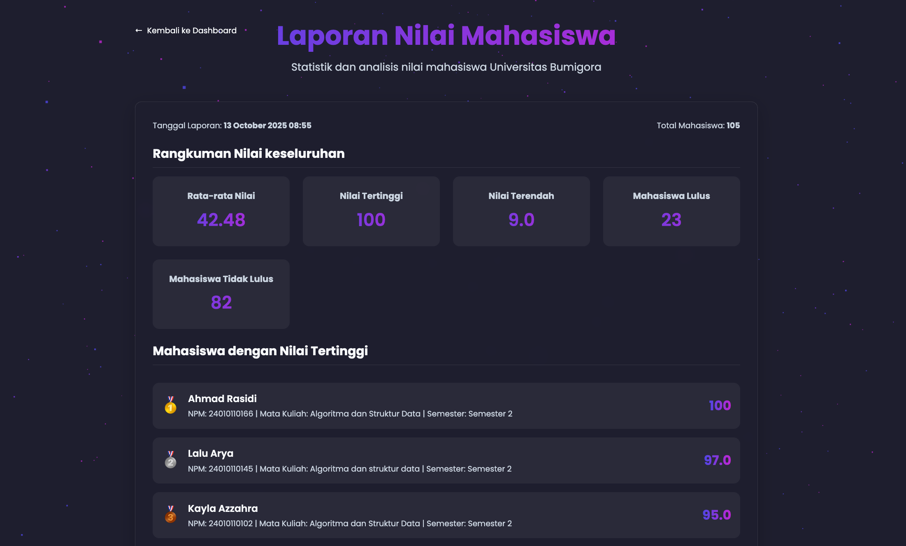

# TUGAS_BESAR – Aplikasi Nilai Mahasiswa

[](https://www.python.org/)
[](https://flask.palletsprojects.com/)
[](LICENSE)
[](https://github.com/rasidi3112/TUGAS_BESAR/commits/main)

---

## Deskripsi

**TUGAS_BESAR** adalah aplikasi web **manajemen nilai mahasiswa** berbasis **Python Flask**. Sistem ini membantu dosen atau admin untuk:

* Menambahkan, melihat, dan menghapus data mahasiswa.
* Menghitung grade huruf (A–E) dari nilai angka secara otomatis.
* Menyajikan statistik lengkap, seperti rata-rata, nilai tertinggi, nilai terendah, jumlah lulus/tidak lulus, dan distribusi grade.
* Menampilkan top mahasiswa, statistik per semester, dan per mata kuliah.
* Mengekspor laporan ke **PDF** dan **Excel** secara profesional.
* Menyediakan **API JSON** untuk integrasi dengan aplikasi lain.

**Ini adalah bagian dari project kami sebagai Tugas Besar/Tugas Akhir UAS Semester 2 mata kuliah Algoritma dan Struktur Data.**

---

## Nama Kelompok

1. Ahmad Rasidi
2. Kayla Azzahra
3. Dimas Risky
4. Firman Maulana

---


## Screenshot

### Halaman Utama



### Laporan Nilai Mahasiswa



---

## Teknologi

* **Python 3.x** – Bahasa utama.
* **Flask** – Web framework ringan.
* **Pandas** – Analisis dan manipulasi data.
* **PDFKit** – Ekspor laporan ke PDF.
* **OpenPyXL** – Ekspor laporan ke Excel.
* **JSON** – Database sederhana.

---

## Fitur Utama

1. **Manajemen Data Mahasiswa** – CRUD sederhana untuk data mahasiswa.
2. **Grade Otomatis** – Konversi nilai angka ke A/B/C/D/E.
3. **Statistik Lengkap** – Rata-rata, nilai tertinggi, nilai terendah, jumlah mahasiswa, distribusi grade, statistik per semester, dan per mata kuliah.
4. **Ekspor Laporan** – PDF dan Excel siap digunakan dengan ringkasan statistik.
5. **API JSON** – Mengambil dan menghapus data mahasiswa melalui API.

---

## Instalasi & Cara Menjalankan

### 1. Clone Repository

```bash
git clone https://github.com/rasidi3112/student-grade-application.git
cd student-grade-application
```

### 2. Membuat Virtual Environment

**Mac/Linux:**

```bash
python3 -m venv .venv
source .venv/bin/activate
```

**Windows:**

```bash
.venv\Scripts\activate
```

### 3. Install Dependencies

```bash
pip install -r requirements.txt
```

### 4. Jalankan Aplikasi

```bash
python3 app.py
```

### 5. Akses Aplikasi

Buka browser dan kunjungi:

```text
http://127.0.0.1:5000/
```

---

## Development Log

| Date       | Update                                 |
| ---------- | -------------------------------------- |
| 2026-09-03 | Project structure documentation review |
| 2026-09-04 | Installation documentation maintenance |
